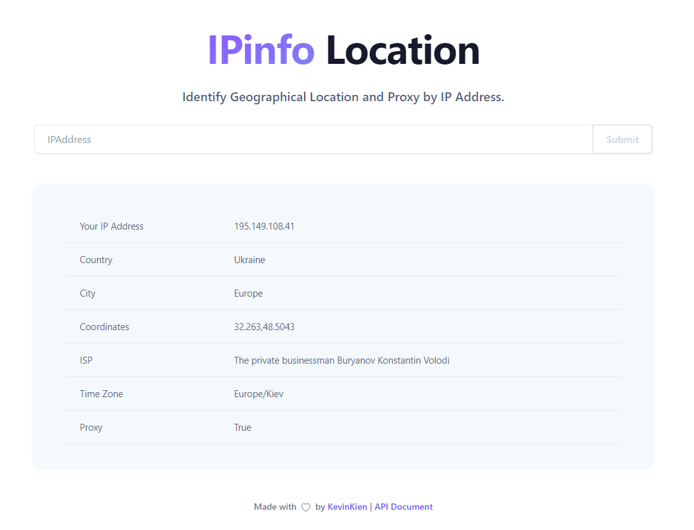

<h1 align="center">
  Webservice & API IPInfo
</h1>

<h4 align="center"> Identify Geographical Location and Proxy by IP Address </h4>

<p align="center">
  <a href="#how-it-works">How It Works</a> •
  <a href="#install">Install</a> •
  <a href="#api-documentation">API Documentation</a> 
</p>

Webservice and API solution to identify country, region, city, latitude & longitude, ZIP code, time zone, ISP, VPN and residential proxies. IPAddress information is obtained from GeoIP2 and checking IPAddress is proxy or not is obtained from IP2Proxy.com.

## How It Works
<h3 align="center">
  </a>
</h3>

## Install

### Run with docker
Build image with dockerfile.
```
docker build -t ipinfo:1.0.0 -f Dockerfile .
```

Run container
```
docker run -it --name ipinfo -p 8080:8080 -h ipinfo ipinfo:1.0.0
```

### Run with Python
Install python3 and pip3
```
sudo apt-get install python3 python3-pip
```
Install pakages
```
pip3 install -r requirements.txt
```
Run service
```
python3 runserver.py
```
### Usage
Access to ip:port example: ```http://127.0.0.1:8080```

## API Documentation

### API get ip info
```
curl http://192.168.1.108:8080/api/195.149.108.41
{"City":"Europe","Country":"Ukraine","IPAdress":"195.149.108.41","ISP":"The private businessman Buryanov Konstantin Volodi","Location":"32.263,48.5043","Time_zone":"Europe/Kiev"}
```

### API check ip proxy
```
curl http://192.168.1.108:8080/api/proxy/195.149.108.41
{"IPAdress":"195.149.108.41","proxy":"true"}
```
